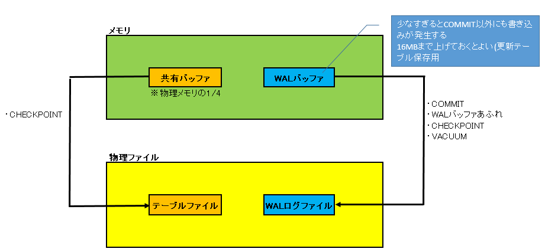
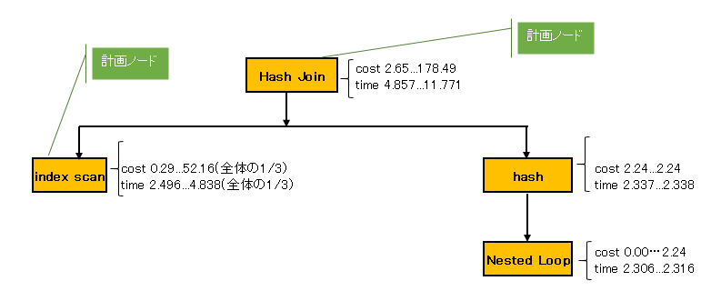

# 構築手順
### インストール
### マスタ構築
#### postgresql.conf修正
#### pg_hba.conf修正

### スレーブ構築
#### マスタの複製
#### postgresql.conf修正
#### pg_hba.conf修正

### WALログについて
 * トランザクション処理において、常に追記されるだけで読み込みはほとんど行われない。
 * テーブルファイルやインデックスファイルはデータを読み書きするため、ランダムに読み書きされるファイルであり、サイズも大きくなる。
 * テーブル・インデックスやトランザクションログは別々のディスクに配置するのが好ましい。アクセスパターンが異なるデータについては、別ディスクに配置することでパフォーマンスが向上する可能性がある。

### WALログファイル(物理ファイル)への書き込みタイミング

|内容|備考|
|-|-|
|実行中のトランザクションがcommitされたとき|wal buffer※1<br>→walファイルへ書き込まれる|
|WALバッファがあふれたとき||
|checkpoint、vacuum時||
|wal writerが作動した時|wal_writer_delayで設定<br>デフォルト200ミリ秒|
|更新系SQL実行時<br>検索系SQL(HOTによる不要なタプルの削除と並べ替え発生時)||
※1:wal bufferには更新データを保存。データ更新は、共有バッファとWALバッファに対して行われる。

### WALログ(pg_wal)への書き込みの流れ

|順番|内容|備考|
|-|-|-|
|1.|Update処理を実行||
|2.|CLOG更新、XIDをIN_PROGRESSに設定||
|3.|共有バッファにタプルを追加後、XLogInsert()でWALバッファへ更新データを書き込む||
|4.|commitに関するWALログをWALバッファへ書き込む||
|5.|WALログファイルに同期書き込み||
|6.|CLOGの更新、XIDをCOMMITEDに変更。VACUUMが削除するまで残る||

前回のチェックポイント後に、初めてタプルが追加されたブロックは、ブロック全体をWALへ書き込む。  
同じブロックへのタプルの追加は差分のみWALへ書き込む

### WALログ(pg_wal)の切り替えタイミング

|内容|備考|
|-|-|
|WALログを使い切った時||
|pg_switch_xlog()を実行時||
|アーカイブモード+archive_timeoutを過ぎたとき||

### チェックポイント実施のタイミング

|内容|備考|
|-|-|
|checkpoint実行時||
|checkpoint_timeout間隔||
|max_wal_sizeに到達時||
|オンラインBK開始時<br>pg_start_backup<br>pg_stop_backup||
|インスタンス停止時||
|インスタンス構成時||
|pg_ctl stop -m immediateコマンド以外|強制停止(ロールバックされる)|
|create database、drop database時||

下記にメモリから物理ディスクにデータを反映する起因を示す。


### VACUUMの特徴
* 初回のVACUUMはテーブルのフルスキャンを行いVisibility Mapを作成する
* 2回目以降のVACUUMは部分スキャンを行い、Visibility Mapを最新化
* Visibility Mapは更新処理(UPDATE/DELETE)で更新される
* 以降は、Visibility Mapを見て必要なところだけVACUUMを行い、回収領域はFreeSpaceMapに登録する。
* ページ内のデータ変更が実施されるため、ガベージ回収に伴いWALが出力される。

### VACUUM処理の流れ  
・SharedUpdateExecuteLockをかける  
  →VACUUM処理中もテーブルの読書可  
・VisibilityMapをもとに不可視タプルを含むブロックのみ処理を行う  
SQL:vacuum {テーブル}  
  ※｛テーブル｝をつけないとシステムカタログを含むデータベース全体がVACUUMされる  
OS:vacuumdb {DB}

|順番|内容|備考|
|-|-|-|
|1|先頭からテーブルを読み込む。<br>VMをチェックし、不要行を含むページがあれば、ゴミタプルとして記録<br>※対象ページの全行をチェック<br>※meintenance_work_memを超えたら次のフェーズへ|Scanフェーズ|
|2|全ページを走査後、1の記録した不要行に対して、インデックスを削除|vacuumフェーズ|
|3|不要なタプルを削除|vacuumフェーズ|
|4|有効なタプルを並び替え(ブロック内のみ)|cleanupフェーズ|
|5|FSM更新|cleanupフェーズ|
|6|pg_classのrelpages、reltuplesを更新|cleanupフェーズ|
|7|CLOGを更新|cleanupフェーズ|

### VACUUM FULLの流れ  
・処理の流れはVACUUMと同様。ただ、大きな違いとして下記点が挙げられる。  
・AccessExclusiveLockをかける  
  →処理中の読書不可  
・ブロックをまたいで有効なタプルを並び変える  
・空のファイルを作成し、そのファイルにコピーしていく(容量が2倍になる)  
・ブロックを切り詰める

### クラッシュリカバリの流れ

|順序|内容|備考|
|-|-|-|
|1|pg_controlからチェックポイント位置を確認||
|2|WALから前回チェックポイント後に発生したトランザクション情報を読み込み||
|3|チェックポイント後は、最初の更新でブロック全体がWALに書き込まれている。<br>よって、ブロック全体をリカバリ||
|4|WALから更新トランザクションを適用||
|5|最新のWALまで更新トランザクションを適用||


### アーカイブ処理のタイミング

|内容|備考|
|-|-|
|60秒間隔||
|SIGUSR1シグナルを受信したとき||
|pg_log/archive_statusを検索し、.readyファイルを発見<br>archive_commandを実行し、.ready→.doneに変更||
|WALの切り替え時ではなく、メモリの更新がディスクに反映されて不要になった時||

### FILFACTOR
 * ブロックの使用率が指定の値以上になった場合、不要なタプルを削除して有効なタプルを並び替える。  
 * 空き領域を確保しておくことで、データがブロックにまたがることを防ぐ。
 * ブロックの使用率が指定した値以上になった場合、不要なタプルを削除して有効なタプルを並び替える
    * autovacuumを減らせる(VACUUMはかなりのI/Oトラフィックを発生させる)
 * update時に同じページへのアクセスで済むためパフォーマンスが向上する
 * 更新が頻繁に行われるテーブル、インデックスはFillfactorの値をデフォルトから下げる
 * create tableの際に、with句で設定する
 * 確認するにはpg_classカタログのreloptions列を参照
 
### Index Only Scan
* Index-Only-ScanはVisibility Mapのビットが立って入れば、テーブルは見ない。
* selectの検索がインデックスのKeyのみの場合、テーブルへのアクセスを省略する。
* VisibilityMapを見て、可視のブロックはIndexOnlyScan、それ以外はテーブルまでアクセスを実施する。
* 更新が少なく、ほとんどの操作が検索であるテーブルに対し、広範囲で検索を行う場合にテーブルへのアクセスがないため有効

### HOTとは
 * 同一ブロックに更新データを追記する際、インデックスを追加しない(古いインデックスにリンクを貼って再利用)
    * インデックス更新のコストが抑えられる
 * ガーベージの自動回収(VACUUMいらず)
 * HOTが機能するための前提として、「インデックスキーの更新が起こらない」
 * 2つ目のコツは、「いらないインデックスは削除する」
 * 3つ目のコツは「更新の多いテーブルはFILLFACTORで空き領域を作っておこう」
    * ラインポインタのリダイレクトによりインデックス更新のスキップを実現している
    * 同じページに新規レコードを配置する空きがない場合は、HOTの「不要なインデックスをスキップする」機能が働かないよ

### 排他ロックの特徴
排他ロック(Access Exclusive Lock)は 業務処理を停めてしまうので要注意

* VACUUM FULL/CLUSTER
テーブルの物理圧縮/物理再編成
物理サイズの圧縮をしたい時によく使う
テーブルに排他ロックを取る処理

* REINDEX
インデックスの再作成
断片化したインデックスのリフレッシュに使う
インデックスに排他ロックを取る処理
システムカタログにロックを取るため、プランナー処理でロック待ちになる

* ALTER TABLE … ADD COLUMN … DEFAULT
テーブルに新規列(デフォルト値あり)追加
デフォルト値なし(NULL)の場合、システムカタログの 更新だけなので一瞬で終わる
でも DEFAULT NULL と明記すると再作成、という罠がある
テーブルの再作成

* ALTER TABLE … SET TABLESPACE
テーブルを異なるテーブルスペースに移動
テーブルの再作成

### レプリケーションスロット
masterがslaveに必要なWALを判別して、自動削除しないように操作する仕組み。レプリケーション方法と合わせて、下記に設定を示す。  

### レプリケーション【非同期】

<span style="font-size: 100%; color: blue;"><b>master側</b></span>

${PGDATA}/postgresql.conf  

|設定|内容|
|-|-|
|max_wal_senders=2|1以上|
|wal_level=replica|V9.5以前のarchive、hot_standbyに相当|
|archive_mode=on|スタンバイDBの数⁺1|
|max_replication_slots=1|スタンバイDBの数|
|archive_command='test ! -f /pg_archive/%f && /bin/cp %p /pg_archive/%f' ※設定例|WALをアーカイブ領域にコピーするコマンド|
|synchronous_commit=※1|同期レベル|
|synchronous_standby_names=設定なし|この設定で同期か非同期に分かれる|

* レプリケーションスロット設定
`select * from pg_create_physical_replication_slot('repl_slot')`

<span style="font-size: 100%; color: green;"><b>slave側</b></span>

${PGDATA}/postgresql.conf  

|設定|内容|備考|
|-|-|-|
|hot_standby=on|スレーブで検索系SQLを受け付けるか|

${PGDATA}/recovery.conf  

|設定|内容|備考|
|-|-|-|
|standby_mode=on||
|primary_conninfo='host=マスターのホスト名 port=5432 application_name=任意の名前' ※設定例|プライマリへの接続情報<br>application_nameはpg_stat_activityビューやログファイル上で該当接続を識別可能にする|
|primary_slot_name='repl_slot'|マスターのレプリケーションスロット名|
|recovery_target_timeline=latest||
|restore_command=’cp /pg_archive/%f %p’ ※設定例|アーカイブをpg_walに戻すコマンド|

### レプリケーション【同期】

<span style="font-size: 100%; color: blue;"><b>master側</b></span>

${PGDATA}/postgresql.conf  

|設定|内容|
|-|-|
|max_wal_senders=2|1以上|
|wal_level=replica|V9.5以前のarchive、hot_standbyに相当|
|archive_mode=on|スタンバイDBの数⁺1|
|max_replication_slots=1|スタンバイDBの数|
|archive_command='test ! -f /pg_archive/%f && /bin/cp %p /pg_archive/%f' ※設定例|WALをアーカイブ領域にコピーするコマンド|
|synchronous_commit=※1|同期レベル|
|synchronous_standby_names='slave1'|同期するスタンバイ名|
|host_standby_feedback=on|自身の情報をマスターに送信|

* レプリケーションスロット設定
`select * from pg_create_physical_replication_slot('repl_slot')`

<span style="font-size: 100%; color: green;"><b>slave側</b></span>

${PGDATA}/postgresql.conf  

|設定|内容|備考|
|-|-|-|
|hot_standby=on|スレーブで検索系SQLを受け付けるか|

${PGDATA}/recovery.conf  

|設定|内容|備考|
|-|-|-|
|standby_mode=on||
|primary_conninfo='host=マスターのホスト名 port=5432 application_name=任意の名前' ※設定例|プライマリへの接続情報<br>application_nameはpg_stat_activityビューやログファイル上で該当接続を識別可能にする|
|primary_slot_name='repl_slot'|マスターのレプリケーションスロット名|
|recovery_target_timeline=latest||
|restore_command=’cp /pg_archive/%f %p’ ※設定例|アーカイブをpg_walに戻すコマンド|

※1:非同期/同期に関連するパラメータ

<table>
<td></td><td colspan="2" align=center><b>synchronous_standby_names</b></td>
</tr>
<tr>
<td><b>synchronous_commit</b></td>
<td><b>設定なし</b></td>
<td><b>設定あり</b></td>
</tr>
<tr>
<td>off</td>
<td colspan="2">プライマリのWALも非同期で書き込む</td>
</tr>
<tr>
<td>local</td>
<td colspan="2">プライマリのWALは同期書き込み、スタンバイは非同期</td>
</tr>
<tr>
<td>on</td>
<td>プライマリのWALのみ同期書き込み</td>
<td>スタンバイのWALを同期で書き込むのをプライマリは待つ</td>
</tr>
</table>

# 障害対応
### システムテーブル(pg_xxx)のインデックスの破損対応

|順序|対応|コマンド|
|-|-|-|
|1|DB停止|`$ pg_ctl stop`|
|2|シングルユーザーモード<br>or<br>postgresql.confのignore_system_indexes=on|`# postgres --single -O -P -D $PGDATA`|
|3|REINDEX実行|`REINDEX index pg_xxxx_index;`<br>Ctrl+Dで終了|
|4|DB再起動|`$ pg_ctl restart`|

※インデックス破損は、実際にインデックスを使用する状況にならないと気づかない可能性あり

### pg_controlを削除
|影響|対応|備考|
|-|-|-|
|データベース起動不可|バックアップから戻す|`pg_resetlog -x`でWALを再作成する必要あり|

### インスタンス異常終了後、最新のWALを削除
|影響|対応|備考|
|-|-|-|
|インスタンスは起動<br>クラッシュリカバリが途中までしか進まない|||

### インスタンス正常終了後、データファイルを削除
|影響|対応|備考|
|-|-|-|
|インスタンスは起動<br>テーブルへのselectはエラー|バックアップから戻す||

### VM/FSMを削除
|影響|対応|備考|
|-|-|-|
|エラーなし<br>SQLも異常なし|次回vacuum時に再作成される||

### global/pg_filenode.mapを削除
|影響|対応|備考|
|-|-|-|
|システムカタログと実ファイルのマッピングが不可になるためデータベース利用不可|バックアップから戻す||

### WALファイル全削除
|影響|対応|備考|
|-|-|-|
|データベース起動不可|`pg_resetlog -f`で強制的にWALを再作成||

### PG_VERSION削除
|影響|対応|備考|
|-|-|-|
|ディレクトリがPostgreSQLと認識できなくなる|バックアップから戻す||

### インスタンス起動中にpg_control削除
|影響|対応|備考|
|-|-|-|
|チェックポイント時にパニックし、インスタンス停止|バックアップから戻す||

### インスタンス起動中にWAL削除
|影響|対応|備考|
|-|-|-|
|自動的に再作成<br>自動再作成不可の時、PANICを起こし、インスタンス停止|`pg_resetlog -f`で強制的にWALを再作成||

### クラッシュリカバリの流れ
1.チェックポイント位置をpg_controlから確認  
2.WALから前回チェックポイント後に発生したトランザクション情報を読み込み  
3.チェックポイント後は、最初の更新でブロック全体がWALに書き込まれているので、ブロックをリカバリ  
4.WALから更新トランザクションの適用  
5.最新のWALまで更新トランザクションを適用  

# 統計情報
||アクセス統計情報|テーブル(カラム)統計情報|備考|
|-|-|-|-|
|用途|autovacuum workerで利用<br>データベースの動作状況を格納|プランナがコスト計算で利用||
|収集方法|stats_collectorプロセス<br>パ:track_activities=on<br>パ:track_counts=on|ANALYZEコマンド ※1<br>VACUUM ALALYZE ※2<br>vacuumdb -z {テーブル名}<br>vacuumdb -avz<br>パ:autovacuum=on ※3<br>パ:track_counts=on|※1:サンプリングによる。負荷はレコード数に関係なく軽量。<br>※2:全件走査のため制度が高い|
|収集タイミング|・各サーバから待機直前に送信される<br>・500msに1回反映<br>・track_activitiesにはリアルタイム反映<br>・pg_stat_テーブルにはトランザクション外で参照|プランナがコスト計算で利用|autovacuum実行時、vacuumコマンド実行時|
|格納テーブル|主要なビュー<br>pg_stat_database<br>pg_stat_activity<br>pg_stat_bgwriter<br>pg_statio_user_tables<br>pg_statio_user_indexes|pg_class(テーブル統計情報)※4<br>pg_statistic(カラム統計情報)※5<br>ともにシステムカタログ|※4:relpages,reltaplesに格納※5:pg_statisticはpg_statsビューで参照|

※3:<br>閾値:autovacuum_analyze_threshold(50)＋autovacuum_analyze_scale_factor(0.1)×レコード数<br>
サンプリング数:default_statistics_target(100)×300行<br>カッコはデフォルト値<br>
例えば、1000行のテーブルに対しては、(50+0.1×1000)の150回の追加、削除、更新があればサンプリング値に従って、統計情報を取得する。  

コストと実際の値が全体に対しての割合と変わらないことに注意する。  


### REINDEX

〇:ロックする
×:ロックなし
||テーブル書き込み|テーブル読み込み|インデックス読み込み|
|-|-|-|-|
|REINDEX|〇|×|〇|
|CREATE INDEX|〇|×|-|
|CREATE INDEX|〇|〇|-|

* `REINDEX index index名;`
→インデックス再構築
* `REINDEX table table名;`
→テーブルに貼られた全インデックス再構築
* `REINDEX database database名;`
→データベースに存在する全インデックス再構築

### Nested Loop(ネステッドループ結合)
* 外側テーブル1行ごとに内側テーブルを1周ループしながら結合
* 外側テーブルの行数が少なく、内側テーブルにインデックスがある場合に処理が高速

※内側テーブル：参照されるテーブル
※外側テーブル：参照するテーブル

### Merge Join(マージ結合)
* 結合キーで外/内テーブルをソート
* 順に突合せ
* 大きなテーブル同士で有効
* 結合キーが主キーだと処理が高速

### Hash Join(ハッシュ結合)
* 内側テーブルの結合キーでハッシュを作成
* ハッシュと外側テーブル(上から1行ずつ)を突合せ
* ハッシュはメモリーに作成
* ハッシュがメモリーより大きい場合、ファイルアクセスが発生
* 小さなテーブル(内側テーブル)と大きなテーブルを結合する場合に有効

# 運用操作
### vmstatを利用して確認すべきポイント

|NO|確認ポイント|内容|
|-|-|-|
|1|メモリのチェック|**si:スワップイン(読み込み)の値が高い**<br>→メモリ不足<br>**so:スワップアウト(書き込み)の値が高い**<br>→メモリ不足|
|2|CPUのチェック|**user使用率が高い**(postgresqlの内部処理の可能性大)<br>→同時接続チェック<br>→SQLの見直し<br>**waitが高い**(ディスクI/O処理がボトルネック)<br>→I/O待ちで待機している状態(CPU割り当てを待っている状態)<br>→割り当てられたCPUでディスクへの読み書きを行う|
|3|rとbのチェック|**r:実行待ちプロセス数の値が高い**<br>→userのCPU使用率が高い<br>**b:I/O wait状態のプロセス数値が高い**<br>→waitのCPU使用率が高い<br><b>rとbの合計がCPU以上</b><br>→負荷が高い<br>**waitが高く、bが高い**<br>→biとboをチェック。どちらかがボトルネック。|

### メモリ使用量

ps alxというコマンドによりおおよそのメモリ使用量を確認できる。  
例えばPostgreSQLのメモリ使用量を調べたい場合は  
`# ps alx | head -1 && ps alx | grep postgres`といった感じ。結果は以下。
```
$ ps alx | head -1 && ps alx | grep postgres
F   UID   PID  PPID PRI  NI   VSZ  RSS WCHAN  STAT TTY        TIME COMMAND
1   502  3370  3364  15   0  8104  220 -      S    ?          0:10 postgres: logger process
1   502  3372  3364  15   0 263552 252720 -   S    ?          8:05 postgres: writer process
1   502  3373  3364  15   0  9104 1132 -      S    ?          0:41 postgres: stats buffer process
```
ここで RSS と表示されているのがメモリーの使用量になる。単位はkB。

### pg_benchツール導入

|NO|内容|コマンド|
|-|-|-|
|1|初期化|`pgbench -i {DB名}`<br>"-s 10"をつけると10万件となる<br>デフォルトでは1万件|
|2|実行|`pgbench -c 10 -t 10 {DB名}`<br>c:接続数<br>t:1クライアントあたりのトランザクション数|

### 第二正規形

部分関数従属をなくす

|注文ID|商品ID|商品名|価格|個数|
|-|-|-|-|-|-|
|1|100|zaku|10|1|
|2|100|zaku|10|2|
|3|200|gundam|30|3|

`商品名`と`価格`は`注文ID`と`商品ID`が決まれば決定する。  
`商品ID`だけでも決定する。
`商品名`と`価格`は「`注文IDと商品ID`」と「`商品ID`」の2つの主キーをもつ  
→一つの主キーにすることが第二正規形
|`注文ID`|`商品ID`|個数|
|-|-|-|

|`商品ID`|商品名|価格|
|-|-|-|

### 第三正規形

推移関数従属をなくす

|伝票番号|店舗ID|店舗名|
|:-:|:-:|:-:|
|→|→|→|

`伝票番号`が決まれば「店舗ID」が決定する。`店舗ID`が決まれば「店舗名」が決定する。  
→推移しないように分解する。

|`伝票番号`|店舗ID|
|-|-|

|`店舗ID`|店舗名|
|-|-|

###タプル
##### データタプルの追記
データを追記する場合、次々と新しいブロックに書き込むことはしない。
空き領域のあるブロックに追記する。そのため、空き領域を効率的に探すためFSMの情報が必要となる。

##### タプル内の情報
ブロック構造の先頭には下記のような情報が登録(一部のみ抜粋)
XLogRecPtr:最も最近のチェックポイントレコードを指すポインタ
pd_lower:空き領域の始まりに対するオフセット
pd_upper:空き領域の終わりに対するオフセット
<br>
レコード自体はブロックの下から詰めていく(レコードの情報。一部抜粋）
t_xmin:このタプルを追記したXID
t_xmax:このタプルを削除、または更新した元のXID
t_cid:このトランザクション内で何番目の追記か
t_ctid:追記された新しいタプルへのポインタ。追記したt_xminへのポインタ
～ユーザデータ

##### 不要タプルの確認
pg_stat_all_tablesのn_dead_tupかcontrib/pgstattupleを導入

### 一般ユーザによるデータベース作成

一般ユーザにはデータベースを作成する権限がない。
よって、一般ユーザにデータベースを作成する権限を付与する必要がある。

|No|内容|コマンド|備考|
|-|-|-|-|
|1|スーパーユーザ(postgres)で一般ユーザ(testuser)を作成|`psql -d template1`<br>`template1=# create user testuser password 'testuser';`||
|2|一般ユーザ(testuser)でデータベースを作成|`template1=> create database testdb;`|ERROR:  データベースを作成する権限がありません<br>一般ユーザにはデータベース作成権限がない|
|3|スーパーユーザ(postgres)で一般ユーザ(testuser)に権限を付与|`template1=# alter role testuser createdb;`||
|4|一般ユーザ(testuser)でデータベースを作成|`$ psql -U testuser -d template1<br>template1=> create database testdb;`|一般ユーザでデータベース作成が可能となる|


### パラメータとか

|No|内容|パラメータやコマンド|備考|
|1|oidの表示|default_with_oids = on|postgresql.conf|
|2|AUTOCOMMITの確認|\echo :AUTOCOMMIT|SQLコマンド|

# 検証

### PITR検証1
```
バックアップ前
testdb3=# select count(*) from pgbench_history ;
 count
-------
     0
(1 row)
↓
バックアップ
↓
データの追加
./pgbench -c 10 -t 1000 testdb3
↓
データの確認
testdb3=# select count(*) from pgbench_history ;
 count
-------
 10000
(1 row)

testdb3=# select * from pgbench_history limit 10 offset 300;
 tid | bid |  aid  | delta |           mtime            | filler
-----+-----+-------+-------+----------------------------+--------
   2 |   1 |  1889 | -4981 | 2018-01-18 10:16:35.78571  |
   5 |   1 | 40788 |  2316 | 2018-01-18 10:16:35.878303 |
   9 |   1 | 54659 |  2482 | 2018-01-18 10:16:35.997249 |
   4 |   1 | 65247 | -4237 | 2018-01-18 10:16:36.043109 |
   8 |   1 | 11714 |  2149 | 2018-01-18 10:16:36.074007 |
   7 |   1 | 43037 |    35 | 2018-01-18 10:16:36.119152 |
   9 |   1 | 57122 |  -710 | 2018-01-18 10:16:36.162916 |
   7 |   1 | 52667 |   477 | 2018-01-18 10:16:36.246212 |
   1 |   1 | 14520 | -4861 | 2018-01-18 10:16:36.292254 |
   3 |   1 | 31635 | -4806 | 2018-01-18 10:16:36.332821 |
(10 rows)
↓
# ps -ef | grep post
postgres   601     1  0 Jan17 ?        00:00:11 /DBdata/bin/postgres -D /DBdata/data

# kill -9 601
その他テーブルをtruncateするのもあり
例）truncate table テーブル名

# ps -ef | grep post
postgres   602     1  0 Jan17 ?        00:00:00 postgres: logger process
postgres   604     1  0 Jan17 ?        00:00:17 postgres: checkpointer process
↓
別のセッションでの接続不可確認
[postgres@koma_asb ~]$ psql -l
psql: could not connect to server: Connection refused
        Is the server running locally and accepting
        connections on Unix domain socket "/tmp/.s.PGSQL.5432"?

PGDATA=/DBdata/data
archive=/DBdata/archive
BACKUP=/pg_backup

1.事前作業
データベースが停止していなければ停止する
pg_hba.conf をいじってリカバリ中は他のユーザーがアクセスできないようにする

2.ファイルの退避
 $ cp -r ${PGDATA}/pg_xlog /tmp/ ※最新のWALが格納されているため退避
 $ mv ${PGDATA} ${PGDATA}.temp ※空き領域にもよる
 →この時点で${PGDATA}ディレクトリはなくなる

3.ベースバックアップのリストア
 $ mkdir ${PGDATA}
 $ chmod 700 ${PGDATA}
 $ rsync -av /pg_backup/* ${PGDATA}

4.退避したファイルのリストア
 $ cp -ipr /tmp/pg_xlog ${PGDATA}

5.recovery.confの修正 ※share配下にサンプルあり
  restore_command='cp /DBdata/archive/%f %p'
  設定例）archive_command = 'test ! -f /pg_archive/%f && /bin/cp /pg_archive/%f %p'

5.リカバリ実施
 $ pg_ctl start

[結果]
testdb3=# select count(*) from pgbench_history ;
 count
-------
 10000
(1 row)

testdb3=# select * from pgbench_history limit 10 offset 300;
 tid | bid |  aid  | delta |           mtime            | filler
-----+-----+-------+-------+----------------------------+--------
   2 |   1 |  1889 | -4981 | 2018-01-18 10:16:35.78571  |
   5 |   1 | 40788 |  2316 | 2018-01-18 10:16:35.878303 |
   9 |   1 | 54659 |  2482 | 2018-01-18 10:16:35.997249 |
   4 |   1 | 65247 | -4237 | 2018-01-18 10:16:36.043109 |
   8 |   1 | 11714 |  2149 | 2018-01-18 10:16:36.074007 |
   7 |   1 | 43037 |    35 | 2018-01-18 10:16:36.119152 |
   9 |   1 | 57122 |  -710 | 2018-01-18 10:16:36.162916 |
   7 |   1 | 52667 |   477 | 2018-01-18 10:16:36.246212 |
   1 |   1 | 14520 | -4861 | 2018-01-18 10:16:36.292254 |
   3 |   1 | 31635 | -4806 | 2018-01-18 10:16:36.332821 |
(10 rows)
```

### PITR検証2
```
1.データの確認
testdb3=# select count(*) from pgbench_history;
 count
-------
 10000
(1 row)

testdb3=# select * from pgbench_history limit 10 offset 300;
 tid | bid |  aid  | delta |           mtime            | filler
-----+-----+-------+-------+----------------------------+--------
   9 |   1 | 46046 |  2807 | 2018-01-18 11:37:34.784132 |
   3 |   1 | 66960 |  -268 | 2018-01-18 11:37:34.89004  |
   1 |   1 | 59202 |  3296 | 2018-01-18 11:37:35.084323 |
   9 |   1 | 12058 |  4784 | 2018-01-18 11:37:35.128881 |
   6 |   1 | 48583 |  -136 | 2018-01-18 11:37:35.162013 |
   3 |   1 | 24669 |  -667 | 2018-01-18 11:37:35.191961 |
  10 |   1 |  1846 |  1809 | 2018-01-18 11:37:35.274762 |
   1 |   1 |  1197 |  1615 | 2018-01-18 11:37:35.340789 |
   1 |   1 | 16415 |  2209 | 2018-01-18 11:37:35.424595 |
  10 |   1 | 76879 | -4681 | 2018-01-18 11:37:35.532239 |


2.バックアップ取得
11:45

3.テーブルの削除
testdb3=# truncate table pgbench_history;
TRUNCATE TABLE
testdb3=# truncate table pgbench_accounts;
TRUNCATE TABLE

4.データベース停止
pg_ctl stop

5.ファイルの退避
 $ cp -r ${PGDATA}/pg_xlog /tmp/ ※最新のWALが格納されているため退避
 $ mv ${PGDATA} ${PGDATA}.temp ※空き領域にもよる
  →この時点で${PGDATA}ディレクトリはなくなる

6.ベースバックアップのリストア
 $ mkdir ${PGDATA}
 $ chmod 700 ${PGDATA}
 $ rsync -av /pg_backup/* ${PGDATA}

7.退避したファイルのリストア
 $ cp -ipr /tmp/pg_xlog ${PGDATA}

8.recovery.confの修正 ※share配下にサンプルあり
 restore_command='cp /DBdata/archive/%f %p'
 設定例）archive_command = 'test ! -f /pg_archive/%f && /bin/cp /pg_archive/%f %p'

9.リカバリ実施
 $ pg_ctl start

⑩00000002.historyの他に00000003.historyが増えた

10.truncateしたテーブルは0件のまま
testdb3=# select count(*) from pgbench_accounts;
 count
-------
     0
(1 row)
testdb3=# select count(*) from pgbench_history;
 count
-------
     0
(1 row)

pg_xlog配下
$ ls -ltr
total 98316
-rw------- 1 postgres postgres 16777216 Jan 18 11:47 0000000200000000000000B1.partial
-rw------- 1 postgres postgres 16777216 Jan 18 11:47 0000000300000000000000B2
-rw------- 1 postgres postgres 16777216 Jan 18 11:47 0000000300000000000000B3
-rw------- 1 postgres postgres 16777216 Jan 18 11:47 0000000200000000000000B0
-rw------- 1 postgres postgres 16777216 Jan 18 11:47 0000000300000000000000B4
-rw------- 1 postgres postgres       42 Jan 18 11:50 00000002.history
-rw------- 1 postgres postgres       85 Jan 18 11:50 00000003.history
drwx------ 2 postgres postgres     4096 Jan 18 11:50 archive_status
-rw------- 1 postgres postgres 16777216 Jan 18 11:50 0000000300000000000000B1

$ cat 00000003.history
1       0/AB20DDC0      no recovery target specified

2       0/B1000098      no recovery target specified

$ cat 00000002.history
1       0/AB20DDC0      no recovery target specified

PITRを実行するたびにtimelineが増えていく
timelineを利用すれば異なる以前の歴史にさかのぼってPITRを実行することが可能。
```

### PGDUMPリストア検証
#### pg_dumpによるバックアップとリストア
 * スクリプト形式（デフォルト）でのバックアップ ※中身見れるよ
```
  $ pg_dump DB名 > DB_バックアップ名
    or
  $ pg_dump DB名 -f DB_バックアップ名
```
 * リストア
```
  $ dropdb DB名
  $ createdb DB名 ※スクリプト形式はcreatedbをしてくれないので作成する必要がある
  $ psql DB名 < DB_バックアップ名
    or
  $ psql -f DB_バックアップ名 DB名
```
 * アーカイブ形式 ※中身見れないよ ただし、テーブル単位でのリストア可能だよ。
```
  $ pg_dump -Fc DB名 -f DB_バックアップ名 ※カスタム形式
  $ pg_dump -Fc DB名 > /tmp/DB_バックアップ名 ※カスタム形式
  $ pg_dump -Ft DB名 -f DB_バックアップ名  ※tar形式
  $ pg_dump -Ft DB名 > /tmp/DB_バックアップ名
```
 * リストア
```
  $ dropdb DB名
  $ pg_restore -C -d DB名 DB_バックアップ名 ※-C オプションを付けるとリストア前にデータベースを作成
  $ pg_restore -C -d DB名 -Ft DB_バックアップ名  ※tar形式
```


#### DBバックアップ＞テーブル単位でのリストア検証
```
pgbench -U testuser -i -s 1 testdb3
pgbench -c 10 -t 10000 testdb3
$ psql -d testdb3
psql (9.6.2)
Type "help" for help.

testdb3=# \d
              List of relations
 Schema |       Name       | Type  |  Owner
--------+------------------+-------+----------
 public | pg_buffercache   | view  | postgres
 public | pgbench_accounts | table | testuser
 public | pgbench_branches | table | testuser
 public | pgbench_history  | table | testuser
 public | pgbench_tellers  | table | testuser
(5 rows)

testdb3=# select count(*) from pgbench_history;
 count
--------
 100000
(1 row)

1.カスタム形式でDBをバックアップ
$ pg_dump -Fc testdb3 > /tmp/testdb3.dmp
$ ls -l /tmp/testdb3.dmp
-rw-r--r-- 1 postgres postgres 1791585 Jan 18 13:44 /tmp/testdb3.dmp

2.テーブルを削除
testdb3=# drop table pgbench_history;
DROP TABLE
testdb3=# \d
              List of relations
 Schema |       Name       | Type  |  Owner
--------+------------------+-------+----------
 public | pg_buffercache   | view  | postgres
 public | pgbench_accounts | table | testuser
 public | pgbench_branches | table | testuser
 public | pgbench_tellers  | table | testuser
(4 rows)

3.バックアップからテーブルをリストア
$ pg_restore -d testdb3 -t pgbench_history /tmp/testdb3.dmp

4.結果確認
testdb3=# select count(*) from pgbench_history;
 count
--------
 100000
(1 row)
```

#### テーブル単位のバックアップ＞テーブル単位でのリストア検証

```
1.テーブル単位のバックアップ
$ pg_dump -Fc testdb3 -t pgbench_history > /tmp/testdb3.dmp

2.テーブル削除
testdb3=# drop table pgbench_history;
DROP TABLE
testdb3=# \d
              List of relations
 Schema |       Name       | Type  |  Owner
--------+------------------+-------+----------
 public | pg_buffercache   | view  | postgres
 public | pgbench_accounts | table | testuser
 public | pgbench_branches | table | testuser
 public | pgbench_tellers  | table | testuser

3.リストア
$ pg_restore -d testdb3 /tmp/testdb3.dmp

4.確認
$ psql -d testdb3
psql (9.6.2)
Type "help" for help.

testdb3=# \d
              List of relations
 Schema |       Name       | Type  |  Owner
--------+------------------+-------+----------
 public | pg_buffercache   | view  | postgres
 public | pgbench_accounts | table | testuser
 public | pgbench_branches | table | testuser
 public | pgbench_history  | table | testuser
 public | pgbench_tellers  | table | testuser
(5 rows)
```
#### テキスト形式のリストア
```
1.バックアップ実施
$ pg_dump testdb3 > /tmp/testdb3.dmp

2.データベース削除
$ dropdb testdb3

3.データベース作成
$ createdb testdb3

4.リストア
$ psql testdb3 < /tmp/testdb3.dmp

5.確認
$ psql -d testdb3
psql (9.6.2)
Type "help" for help.

testdb3=# \d
              List of relations
 Schema |       Name       | Type  |  Owner
--------+------------------+-------+----------
 public | pg_buffercache   | view  | postgres
 public | pgbench_accounts | table | testuser
 public | pgbench_branches | table | testuser
 public | pgbench_history  | table | testuser
 public | pgbench_tellers  | table | testuser
(5 rows)

testdb3=# select count(*) from pgbench_history ;
 count
--------
 100000
(1 row)
```

#### カスタム形式でダンプし、レコードだけ戻す
```
1.テーブル単位のバックアップ
$ pg_dump -Fc testdb3 > /tmp/testdb3.dmp

2.テーブル削除
testdb3=# select count(*) from pgbench_history ;
 count
--------
 100000
(1 row)

testdb3=# delete from pgbench_history ;
DELETE 100000
testdb3=# select count(*) from pgbench_history ;
 count
-------
     0
(1 row)

3.リストア
testdb3=# select datname,oid from pg_database;
  datname  |  oid
-----------+-------
 postgres  | 13269
 testdb    | 16384
 template1 |     1
 template0 | 13268
 dvdrental | 16388
 testdb2   | 16879
 testdb3   | 25223
(7 rows)

testdb3=# select relname,relfilenode from pg_class where relname='pgbench_history';
     relname     | relfilenode
-----------------+-------------
 pgbench_history |       25245
(1 row)

$ pg_restore -d testdb3 -t pgbench_history -a /tmp/testdb3.dmp

4.確認
$ psql -d testdb3
psql (9.6.2)
Type "help" for help.

testdb3=# select datname,oid from pg_database;
  datname  |  oid
-----------+-------
 postgres  | 13269
 testdb    | 16384
 template1 |     1
 template0 | 13268
 dvdrental | 16388
 testdb2   | 16879
 testdb3   | 25223
(7 rows)

testdb3=# select relname,relfilenode from pg_class where relname='pgbench_history';
     relname     | relfilenode
-----------------+-------------
 pgbench_history |       25245
(1 row)

testdb3=# select count(*) from pgbench_history;
 count
--------
 100000
(1 row)
→テーブルのrelfilenodeも一緒なので、データのみリストアされたことがわかる
```

### ロングトランザクション
```
ロングトランザクションはHOTだけでなくVACUUMも阻害する。
長期間実施されているロングトランザクションはpg_stat_activityビューで確認が可能である。
もし、HOTが機能している、またVACUUMを実施しているのに、DBが肥大化しているような場合には、
メンテナンス前にロングトランザクションがいないかをチェックした方がよい。

=# SELECT datname, usename, current_query, waiting,
          (current_timestamp - xact_start) AS duration
     FROM pg_stat_activity WHERE procpid <> pg_backend_pid();

 datname | usename  |     current_query     | waiting |    duration
---------+----------+-----------------------+---------+-----------------
 test    | postgres | <IDLE> in transaction | f       | 00:48:09.23456
(1 row)

上記のカラムは以下の様な情報
・datname : トランザクション処理が行われているDB名
・usename : トランザクション処理を実施しているDBユーザ名
・current_query : トランザクション処理の実施内容
・waiting : トランザクション処理がロック待ちかどうか(t はロック待ち状態)
・duration : 現在の時間とトランザクション開始時間の差分

上記のSQLの結果を見ると、「postgresユーザ」が、「testdbデータベース」にて、トランザクションの開始から、何らかの処理を行い、「48分間放置」されている状態だと分かる。例えば、下記のような処理が行われていないかを確認する必要がある。
・BEGIN;を発行して適当なSELECTをしたまま、COMMITしていないトランザクション
・ロックを持ったまま長期間なにもしていないトランザクション
・巨大なテーブルへのANALYZE処理
```

### インデックスへどれだけアクセスしたか
```
testdb=# SELECT indexrelname, idx_scan, idx_tup_read, idx_tup_fetch
testdb-# FROM pg_stat_user_indexes WHERE relname = 'testtbl';
-[ RECORD 1 ]-+---------------
indexrelname  | testtbl_index
idx_scan      | 0
idx_tup_read  | 0
idx_tup_fetch | 0

上記のカラムは以下の様な情報
・indexrelname : インデックス名
・idx_scan : インデックススキャンの回数
・idx_tup_read : スキャンされたインデックスキーの数
・idx_tup_fetch : 実際にインデックスキーからレコードが読み取られた数
idx_scanが 0 のインデックスは、過去にそのインデックスが使われたことがないということを示す。つまり、SELECT indexrelname FROM pg_stat_user_indexes WHERE idx_scan = 0; の結果出力されたインデックスは、少なくとも現時点では使われていない。
不要なインデックスを調べるのによいね。

更新したデータを配置するための空き領域を、ページ内に持っておくことが重要になる。
この「予め空き領域を確保する」ための機能が FILLFACTOR である。
FILLFACTORはテーブル毎に設定するパラメータで、以下の用にテーブルの作成時、もしくはALTERコマンドでのテーブル定義の変更時に指定が可能である。
=# CREATE TABLE testtbl (id serial PRIMARY KEY, name text) WITH (FILLFACTOR=90);
=# ALTER TABLE testtbl SET (FILLFACTOR=80);

上記のCREATE TABLEでは、FILLFACTOR=90を指定している。
この場合、このテーブルは10%の空き領域を更新用に確保することになります。
20%の空き領域を確保したい場合はFILLFACTOR=80とする。一般的には、FILLFACTOR=90でHOTが十分に機能する。

なお、FILLFACTORを設定すると空き領域をテーブルデータ内に作ることになるため、
テーブルデータの密度が下がる。単純な話、8KBのページに8KBギッシリ利用している状況から8KBのページに6KBまでしか使わないとなるとキャッシュヒット率は低下する。
そのため、INSERT、SELECT処理がメインとなるテーブルについては、キャッシュヒット率を重視する意味で、FILLFACTORは指定せず、デフォルトである 100% の設定を使うほうが良い。
```

### HOT(ガベージの回収)検証

```
ガベージの回収について確認する。pg_stat_user_tablesの情報を監視する方法。
1.テストデータの作成
postgres=# CREATE TABLE hot_test (id int, name text);
postgres=# CREATE INDEX hot_test_index ON hot_test (id);
postgres=# INSERT INTO hot_test SELECT generate_series(1,100),md5(clock_timestamp()::text);

2.インデックスを張っていないnameカラムを更新。
\x
postgres=# UPDATE hot_test SET name='AAA' WHERE id=1;
postgres=# SELECT relname, n_tup_upd, n_tup_hot_upd,n_live_tup, n_dead_tup FROM pg_stat_user_tables WHERE relname='hot_test';
-[ RECORD 1 ]-+---------
relname       | hot_test
n_tup_upd     | 1
n_tup_hot_upd | 1
n_live_tup    | 100
n_dead_tup    | 1

postgres=# UPDATE hot_test SET name='BBB' WHERE id=2;
postgres=# SELECT relname, n_tup_upd, n_tup_hot_upd,n_live_tup, n_dead_tup FROM pg_stat_user_tables WHERE relname='hot_test';
-[ RECORD 1 ]-+---------
relname       | hot_test
n_tup_upd     | 2
n_tup_hot_upd | 2
n_live_tup    | 100
n_dead_tup    | 2

postgres=# UPDATE hot_test SET name='CCC' WHERE id=3;
postgres=# SELECT relname, n_tup_upd, n_tup_hot_upd,n_live_tup, n_dead_tup FROM pg_stat_user_tables WHERE relname='hot_test';
-[ RECORD 1 ]-+---------
relname       | hot_test
n_tup_upd     | 3
n_tup_hot_upd | 3
n_live_tup    | 100
n_dead_tup    | 3

・・・(省略)・・・

postgres=# UPDATE hot_test SET name='HHH' WHERE id=8;
postgres=# SELECT relname, n_tup_upd, n_tup_hot_upd,n_live_tup, n_dead_tup FROM pg_stat_user_tables WHERE relname='hot_test';
-[ RECORD 1 ]-+---------
relname       | hot_test
n_tup_upd     | 8
n_tup_hot_upd | 8
n_live_tup    | 100
n_dead_tup    | 8

・・・(省略)・・・

postgres=# UPDATE hot_test SET name='OOO' WHERE id=15;
postgres=# SELECT relname, n_tup_upd, n_tup_hot_upd,n_live_tup, n_dead_tup FROM pg_stat_user_tables WHERE relname='hot_test';
-[ RECORD 1 ]-+---------
relname       | hot_test
n_tup_upd     | 15
n_tup_hot_upd | 15
n_live_tup    | 100
n_dead_tup    | 15

postgres=# UPDATE hot_test SET name='PPP' WHERE id=16;
postgres=# SELECT relname, n_tup_upd, n_tup_hot_upd,n_live_tup, n_dead_tup FROM pg_stat_user_tables WHERE relname='hot_test';
-[ RECORD 1 ]-+---------
relname       | hot_test
n_tup_upd     | 16
n_tup_hot_upd | 16
n_live_tup    | 100
n_dead_tup    | 16

postgres=# UPDATE hot_test SET name='QQQ' WHERE id=17;
postgres=# SELECT relname, n_tup_upd, n_tup_hot_upd,n_live_tup, n_dead_tup FROM pg_stat_user_tables WHERE relname='hot_test';
-[ RECORD 1 ]-+---------
relname       | hot_test
n_tup_upd     | 17
n_tup_hot_upd | 17
n_live_tup    | 100
n_dead_tup    | 1 ★

postgres=# UPDATE hot_test SET name='RRR' WHERE id=18;
postgres=# SELECT relname, n_tup_upd, n_tup_hot_upd,n_live_tup, n_dead_tup FROM pg_stat_user_tables WHERE relname='hot_test';
-[ RECORD 1 ]-+---------
relname       | hot_test
n_tup_upd     | 18
n_tup_hot_upd | 18
n_live_tup    | 100
n_dead_tup    | 2

n_tup_hot_updがカウントアップされているため、ちゃんとHOT更新がされていることが分かる
しかし、数回の更新ではn_dead_tupが増えていくのみ
つまり、まだガベージの自動回収はされておらず、
17回目の更新で、ガベージ回収を実施すべき閾値(ページにもうあまり空き領域がない状態)を超えたため、n_dead_tupが減ったことがわかる
このように、ガベージが回収されて不要領域がリアルタイムに掃除されていることが分かる。
定期的にこれらの情報を監視することで、ガベージが順調に回収されているかどうかを確認できる
```

### スキーマ検証

スキーマとはデータを格納する場所

```
1.testuserでtestdbに接続し、テーブルを作成
→作成するテーブルは下記
psql -U tesuser -d testdb
create table TripType (
  TripTypeID                  INTEGER NOT NULL,
  Name                        VARCHAR(15),
  Description                 VARCHAR(50),
  LastUpdated                 TIMESTAMP
);

2.作成したテーブルの確認
testdb=> \dt+
                     リレーションの一覧
 スキーマ |   名前   |    型    |  所有者  | サイズ  | 説明
----------+----------+----------+----------+---------+------
 public   | triptype | テーブル | testuser | 0 bytes |
(1 行)

3.triptypeテーブルにデータの追加
→インサートするレコードは下記
insert into TripType values( 1, 'TRNG', 'Training', NULL);

4.結果確認
testdb=> \dt+
                      リレーションの一覧
 スキーマ |   名前   |    型    |  所有者  |   サイズ   | 説明
----------+----------+----------+----------+------------+------
 public   | triptype | テーブル | testuser | 8192 bytes |
(1 行)

→上記のように、スキーマはpublicである。

5.testuserスキーマの作成
testdb=> \q
→一回抜けて
-bash-4.1$ psql -d template1
→postgresユーザでtemplate1に接続

template1=#
template1=# create schema testuser;
CREATE SCHEMA
→testuserスキーマができた

6.テーブル名にスキーマを追加して、テーブル作成
-bash-4.1$ psql -d testdb;
→postgresユーザでtestdbに接続
→testdb内にTripTypeテーブルを作成
create table testuser.TripType (
  TripTypeID                  INTEGER NOT NULL,
  Name                        VARCHAR(15),
  Description                 VARCHAR(50),
  LastUpdated                 TIMESTAMP
);

ERROR:  スキーマ"testuser"は存在しません
→何？testuserスキーマ作ったじゃん。
つまりtemplate1のDBにtestuserスキーマを作ってしまったのでは？

testdb=# create schema testuser;
CREATE SCHEMA
→もしや、DB単位でスキーマを用意する必要があるのでは。
→今度はうまくいった。

7.testdbにtestuserスキーマのテーブルを作成
testdb=# create table testuser.TripType (
testdb(#   TripTypeID                  INTEGER NOT NULL,
testdb(#   Name                        VARCHAR(15),
testdb(#   Description                 VARCHAR(50),
testdb(#   LastUpdated                 TIMESTAMP
testdb(# );
CREATE TABLE


testdb=# select * from triptype;
 triptypeid | name | description | lastupdated
------------+------+-------------+-------------
          1 | TRNG | Training    |
(1 行)

testdb=# select * from testuser.triptype;
 triptypeid | name | description | lastupdated
------------+------+-------------+-------------
(0 行)

testdb=> \dt triptype
            リレーションの一覧
 スキーマ |   名前   |    型    |  所有者
----------+----------+----------+----------
 public   | triptype | テーブル | testuser
(1 行)
→publicスキーマのtriptypeテーブル

testdb=> \dt testuser.triptype
            リレーションの一覧
 スキーマ |   名前   |    型    |  所有者
----------+----------+----------+----------
 testuser | triptype | テーブル | postgres
(1 行)
→testuserスキーマでテーブルできているじゃん。
testuserスキーマはpostgresユーザで作成しているので、所有者はpostgresとなっている

8.tesuserスキーマのtriptypeテーブルにレコードを追加
psql -U testuser -d testdb
insert into tesuser.TripType values( 2, 'SALES', 'Sales', NULL);
testdb=> insert into testuser.TripType values( 2, 'SALES', 'Sales', NULL);
→testuserではtestdbに接続できてもtestuser.Triptypeテーブルにレコードの追加はできないようだ。

ERROR:  スキーマ testuser への権限がありません
行 1: insert into testuser.TripType values( 2, 'SALES', 'Sales', N...
→testuserでは、スキーマへのアクセス権限ないって。
→マニュアルには以下のように記載。
ユーザは、デフォルトでは所有していないスキーマのオブジェクトをアクセスすることはできません。
アクセスするためには、そのスキーマの所有者からスキーマのUSAGE権限を付与してもらう必要があります。

→つまり、postgresユーザでスキーマを作成したからpostgresユーザでtestuserにUSAGE権限を付与する必要あり？
testdb=> \q
→一回抜けて
-bash-4.1$ psql -d testdb;
testdb=# grant usage on schema testuser to testuser;
→postgresユーザでtestuserに対し、testuserスキーマへのusage権限付与

→テーブル作成しようとしたが、まだ権限がないってよ。
testdb=> insert into testuser.TripType values( 2, 'SALES', 'Sales', NULL);
ERROR:  リレーション triptype への権限がありません

testdb=# grant all on schema testuser to testuser;
GRANT
→わからんので、全権限付与。
→これでどうだ。

testdb=# \q
-bash-4.1$ psql -U testuser -d testdb;

testdb=> insert into testuser.TripType values( 2, 'SALES', 'Sales', NULL);
ERROR:  リレーション triptype への権限がありません
→まだだめだよ。

→testuserスキーマの所有者はpostgresだね。
testdb=# \dn+
                            スキーマ一覧
   名前   |  所有者  |      アクセス権      |          説明
----------+----------+----------------------+------------------------
 public   | postgres | postgres=UC/postgres+| standard public schema
          |          | =UC/postgres         |
 testuser | postgres | postgres=UC/postgres+|
          |          | testuser=UC/postgres |

testdb=# insert into testuser.TripType values( 2, 'SALES', 'Sales', NULL);
INSERT 0 1
→postgresユーザで接続したtestdbでは、testuser.TripTypeにインサートできるわけね。

testdb=# \q
-bash-4.1$ psql -U testuser -d testdb;
→抜けて、testuserでtestdbに接続

-bash-4.1$ psql -U testuser -d testdb;
testdb=> \dt;
            リレーションの一覧
 スキーマ |   名前   |    型    |  所有者
----------+----------+----------+----------
 testuser | triptype | テーブル | postgres
→testuserスキーマが表示。publicじゃないのかよ。

testdb=> select * from triptype;
ERROR:  リレーション triptype への権限がありません
→えっ。

testdb=> select * from public.triptype;
 triptypeid | name | description | lastupdated
------------+------+-------------+-------------
          1 | TRNG | Training    |
→publicスキーマは表示されるね。

testdb=# grant select on testuser.triptype to testuser;
GRANT
→上記のように、postgresユーザでtestuser.triptypeへの参照権限を与えたら
見えるようになった。
※少し前でgrant all ,usage権限を付与したが、
grant all on testuser.triptype…
とか
grant usage on testuser.triptype…
とかする必要があるのでは。あるいは、
grant usage on schema testuser to testuser;
↑これ、そもそも間違えてて
grant usage on testuser to testuser;
↑こうじゃん。！！

testdb=> \dt;
            リレーションの一覧
 スキーマ |   名前   |    型    |  所有者
----------+----------+----------+----------
 testuser | triptype | テーブル | postgres
(1 行)

testdb=> select * from triptype;
 triptypeid | name  | description | lastupdated
------------+-------+-------------+-------------
          2 | SALES | Sales       |
(1 行)

testdb=> select * from public.triptype;
 triptypeid | name | description | lastupdated
------------+------+-------------+-------------
          1 | TRNG | Training    |
(1 行)

→testuserユーザと同じ名前のtestuserスキーマができているので、
最初の参照は$userということからpublicのテーブルではなく、testuserスキーマの
テーブルから検索しているようだ。

おしまい。
```

###### レコードを更新して、ブロックの内部がどのように変化するか
```
testdb=# create extension pageinspect;
testdb=# UPDATE t1 SET uname = 'update 1' WHERE uid = 101;
UPDATE 1
testdb=# SELECT lp,lp_off,lp_flags,lp_len,t_xmin,t_xmax FROM heap_page_items(get_raw_page('t1', 0));
 lp | lp_off | lp_flags | lp_len | t_xmin | t_xmax
----+--------+----------+--------+--------+--------
  1 |   9152 |        1 |     40 |   1959 |   1960
  2 |   9112 |        1 |     40 |   1960 |      0

t_xmin:そのレコードを作成したトランザクションのトランザクションID
t_xmax:逆にそのレコードを削除したトランザクションのトランザクションID
レコードを更新すると、先ほどのレコード（lp==1）のt_xmaxが1960に設定され、新しいレコード（lp==2）が作成される。
この時、新しく作成されたレコードのt_xminの値（1960）が古いレコードのt_xmaxの値（1960）と同じになっていることが分かる。つまり、古いレコード（lp==1）を削除するのと同時に新しいレコード（lp==2）を追加している。
このように、PostgreSQLのUPDATEの処理では、古いレコードにt_xmaxを設定することで「削除したことにして」、新しいレコードを作成することによって、「更新処理」を行っているように動作する。
```

### DROP TABLEするとrelfilenodeも変わる
```
testdb3=# drop table pgbench_history;
DROP TABLE
$ pg_restore -d testdb3 -t pgbench_history  /tmp/testdb3.dm
p
→テーブルのみをリストア
$ psql -d testdb3
psql (9.6.2)
Type "help" for help.

testdb3=# select datname,oid from pg_database;
  datname  |  oid
-----------+-------
 postgres  | 13269
 testdb    | 16384
 template1 |     1
 template0 | 13268
 dvdrental | 16388
 testdb2   | 16879
 testdb3   | 25223
(7 rows)
→データベースは削除していないので、OIDは変わらない

testdb3=# select relname,relfilenode from pg_class where relname='pgbench_history';
     relname     | relfilenode
-----------------+-------------
 pgbench_history |       25257
(1 row)
→テーブルはノードIDが変更される
```

# 共有バッファ使用状況の確認

### pgstattupleの導入(v9.1以降)
```
1.追加するDBに接続し
   $ psql -d pgbench1

2.下記を実行
  pgbench1=# CREATE EXTENSION pgstattuple;
  CREATE EXTENSION

  pgbench1=# \d
              List of relations
 Schema |       Name       | Type  |  Owner
--------+------------------+-------+----------
 public | pgbench_accounts | table | postgres
 public | pgbench_branches | table | postgres
 public | pgbench_history  | table | postgres
 public | pgbench_tellers  | table | postgres

  pgbench1=# SELECT * FROM pgstattuple('pgbench_accounts');

  ※アンインストールは
  pgbench1=# DROP EXTENSION pgstattuple;
  DROP EXTENSION

3.実行結果
  pgbench1=# \x
  Expanded display is on.
  pgbench1=# SELECT * FROM pgstattuple('pgbench_accounts');
  -[ RECORD 1 ]------+---------
  table_len          | 13434880		テーブルファイルのサイズ（バイト）13MB
  tuple_count        | 100000		レコード数
  tuple_len          | 12100000		レコード長の合計（バイト）
  tuple_percent      | 90.06		テーブルファイルにおけるレコード部分の割合
  dead_tuple_count   | 0		削除済みレコード数
  dead_tuple_len     | 0		削除済みレコード長の合計（バイト）
  dead_tuple_percent | 0		テーブルファイルにおける削除済みレコード部分の割合
  free_space         | 188960		再利用可能な空き領域（バイト）
  free_percent       | 1.41		テーブルファイルにおける再利用可能な空き領域の割合

削除済みのスペースが発生するのはテーブルだけでなく、インデックスも同様。確認するにはpgstatindexを利用する
  pgbench1=# \d pgbench_accounts
     Table "public.pgbench_accounts"
    Column  |     Type      | Modifiers
  ----------+---------------+-----------
   aid      | integer       | not null
   bid      | integer       |
   abalance | integer       |
   filler   | character(84) |
  Indexes:
      "pgbench_accounts_pkey" PRIMARY KEY, btree (aid)

  pgbench1=# SELECT * FROM pgstatindex('pgbench_accounts_pkey');
  -[ RECORD 1 ]------+--------
  version            | 2		BTreeインデックスのバージョン
  tree_level         | 1		ツリーの深さ
  index_size         | 2252800		インデックスファイルのサイズ
  root_block_no      | 3		ルートページのブロック番号
  internal_pages     | 0		インターナルページの数
  leaf_pages         | 274		リーフページの数
  empty_pages        | 0		空のページ数
  deleted_pages      | 0		削除済みページ数
  avg_leaf_density   | 89.83		リーフページの充足率
  leaf_fragmentation | 0		リーフページの断片化率
```

# 拡張モジュール

モジュールを入れておいて、必要な時にON/OFFするとよい。

1.pg_stat_statements
* 実行されたSQLの回数や累積所要時間が取れる
* SQLごとのキャッシュヒット率とかもわかる
* PostgreSQL 9.5 からはレスポンスのMIN/MAX/MEAN/STDDEVもわかる！
<br>

2.auto_explain
* 指定時間以上かかったSQLの実行計画をログに出す
* 実行計画が変わったことによる性能劣化が分かりやすい！
* 試験時の実行計画確認にも使える
<br>

3.pg_hint_plan
* 実行計画を制御するモジュール
* OracleのHINT句相当のもの
* 困ったときのチューニング用に！

# お役立ち、サンプルDB作成等

### DB作成
1.DBクラスタ作成
2.ユーザ作成
3.テーブルスペース作成
4.データベース作成
5.CREATE権限作成
6.アクセス権付与

### 連番を生成する
```
SELECT generate_series(1,1000);
SELECT generate_series(1,1000,2);
```

### ランダムな数値を生成する
```
SELECT random();
→0から99までのランダム数値を得る
SELECT (random() * 10000)::int % 100;
```

### 日付/タイムスタンプデータを生成する
```
SELECT CURRENT_TIMESTAMP - interval '1 week 2 day';
→特定の日付開始から終了まで、1日デクリメントしたものを5日分
SELECT generate_series('2013-12-31','2013-12-25', -'1 day'::interval)::date LIMIT 5;
```

### ランダムな文字列を生成する
```
SELECT md5(clock_timestamp()::text) FROM generate_series(1,3);
```

### ログ取得
```
> ￥o ファイル名
```

### PostgreSQL select文結果 CSV ファイル出力
-A 桁そろえをしない  
-F セパレータを指定  
-t 列名と結果の行数フッタなどの表示を無効にします  
-c コマンド実行  
```
PSQL="psql -U statuser -t -A -F, tokeiinfo"

上記の場合は、セパレータをカンマにしている
select を CSV で出力 (バッチモード)

$ psql -F ',' -A -t -c 'select * from table'
```

### 接続数の確認
```
select pid || ' (' || usename || ' using ' || datname || ')' from pg_stat_activity order by pid,usename,datname;
SELECT datname, usename, COUNT(*) FROM pg_stat_activity GROUP BY datname, usename;
```

### swapの回避
swapを避けるためには、以下の式を目安に設定
shared_buffers + (max_connections * (2MB + work_mem) ) + (OSや他プログラム用メモリ) < 実メモリ

### shared_buffersの値
shared_buffers >= max_connections × 2でなければ遅延が発生する
shared_buffers パラメータは、PostgreSQL データベース サーバで共有メモリ バッファに使用されるメモリの量を指定します。
デフォルトは 32MB ですが、UNIX カーネル設定でサポートされない場合には 32MB より小さい場合があります。
この設定は 128KB 以上とし、少なくとも max_connections の設定値に 16KB をかけた値にする必要があります。
PostgreSQL のドキュメントでは、適切なパフォーマンスを得るためにこのパラメータを最小値よりかなり大きく設定する必要があると記述されています。
運用環境のインストールでは、数十 MB に設定することが推奨されます。
このパラメータを変更した場合は、データベース クラスタを再起動する必要があります。

### キャッシュヒット率の確認
```
template1=# SELECT datname,round(blks_hit*100/(blks_hit+blks_read), 2) AS cache_hit_ratio FROM pg_stat_database WHERE blks_read > 0;
```

### トングトランザクションの処理と経過時間の確認
```
SELECT procpid, waiting, (current_timestamp - xact_start)::interval(3) AS duration, current_query FROM pg_stat_activity WHERE procpid <> pg_backend_pid();
```

### ロック待ちとなっている処理内容と対象のテーブルを確認
```
SELECT l.locktype, c.relname, l.pid, l.mode, substring(a.current_query, 1, 6) AS query, (current_timestamp - xact_start)::interval(3) AS duration FROM pg_locks l LEFT OUTER JOIN pg_stat_activity a ON l.pid = a. procpid LEFT OUTER JOIN pg_class c ON l.relation = c.oid WHERE NOT l.granted ORDER BY l.pid;
```

### スキーマ一覧の表示
```
testdb=\dn
testdb=# select oid, * from pg_namespace;
  oid  |      nspname       | nspowner |               nspacl
-------+--------------------+----------+-------------------------------------
    99 | pg_toast           |       10 |
 11816 | pg_temp_1          |       10 |
 11817 | pg_toast_temp_1    |       10 |
    11 | pg_catalog         |       10 | {postgres=UC/postgres,=U/postgres}
  2200 | public             |       10 | {postgres=UC/postgres,=UC/postgres}
 13002 | information_schema |       10 | {postgres=UC/postgres,=U/postgres}
```

### DBのコピー
マスタのデータをスレーブへコピー
※192.168.1.11はマスター
以下のコマンドはスレーブにログインして、マスターのdb1をdb2へコピーしている
`pg_dump -h 192.168.1.11 db1 | psql db2`


